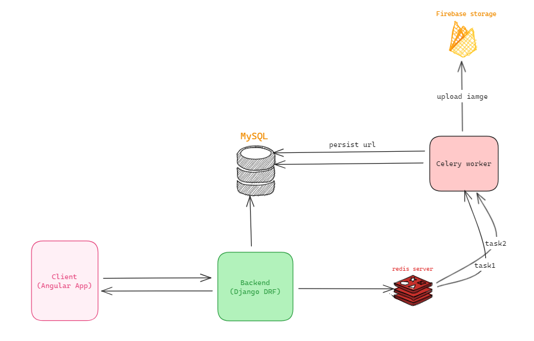
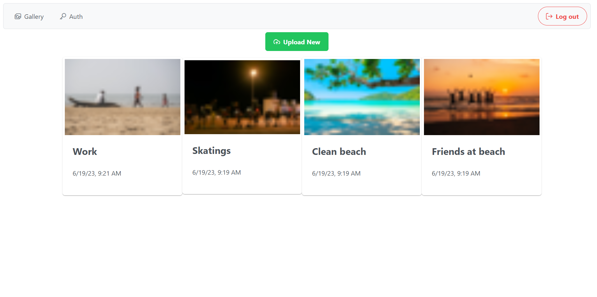
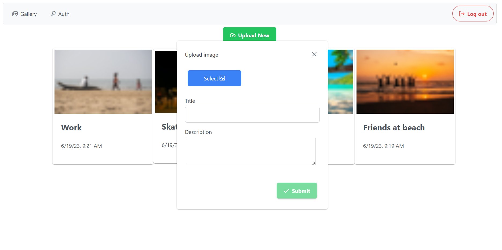
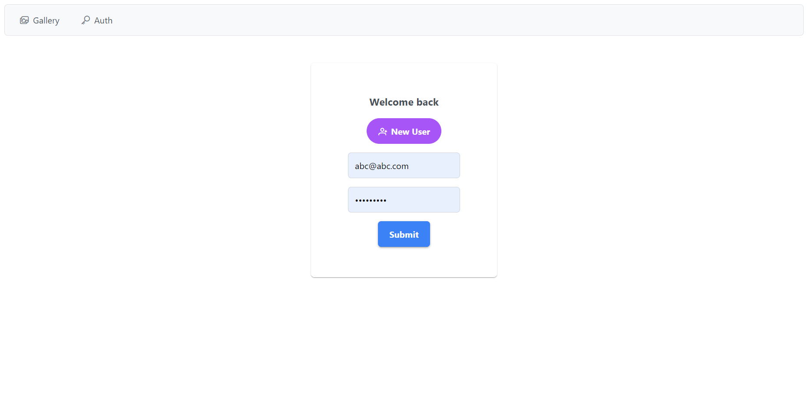
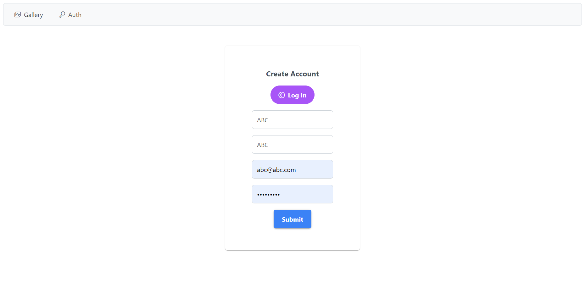
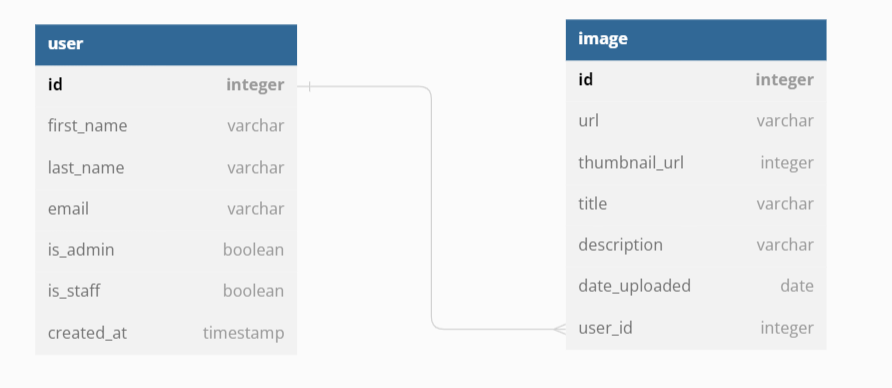

# Async Image Gallery
> This repo contains frontend(Angular) and backend(Django DRF) of an SPA.
## High Level Design

### Frontend
### Screenshots:
| Home | Upload Dialog | Auth(Login) | Auth(Register) |
| ----------- | ---------- |---------- |---------- |
| ||||
<!-- | Upload Dialog||
| Auth(Login)       ||
| Auth(Register)        || -->

#### setup:
(start backend server first)
1. `cd frontend`
2. `npm i` to install dependencies
3. `ng serve`

### Backend
###### Swagger UI: http://127.0.0.1:8000/api/schema/docs/
###### database design: 
* 
* or paste `./dbdiagram[dot]io.txt` at [dbdiagram.io](dbdiagram.io/d)

#### Note:
1.  Project name is `flagship`
2.  3 apps: `common`, `gallery` and `user`

#### Setup:
1. create venv, using 
    `python -m venv venv`
2. activate the environment 
    ``` BASH
    Ubuntu `source venv/bin/activate`
    Windows Powershell `venv\Scripts\Activate.ps1`
    Windows CMD `venv\Scripts\activate.bat`
    ```
3. install dependencies
    `pip install -r requirements.txt`
4. connect with local MySQL instance at `flagship/flagship/settings/dev.py`
    ```
    DATABASES = {
        'default': {
            'ENGINE': 'django.db.backends.mysql',
            'NAME': '<schema_name>',
            'USER': '<user_name>',
            'PASSWORD': '<password>',
            'HOST':'localhost',
            'PORT':'3306',
        }
    }

    # change redis server's port, default is 6379
    CELERY_BROKER_URL = "redis://localhost:6379"
    CELERY_RESULT_BACKEND = "redis://localhost:6379"
    ```
5. set firebase storage credentails at `./flagship/common/storage.py`
    ```
    cred = credentials.Certificate("C:\\Path\\to\\key")
    firebase_admin.initialize_app(cred, {
        'storageBucket': '<your-app-url>.appspot.com'
    })
    ```
5. start redis server
    ```
    > redis-server
    ```
6. start celery client (call this inside ./flagship)
    ```
    > celery --app=flagship  worker -l INFO --pool=solo
    ```
7. make migrations, migrate and runserver

    ``` Bash
    cd
    python manage.py makemigrations
    python manage.py migrate

    python manage.py runserver 8000
    ```